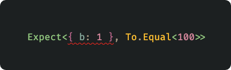

> Documentation is currently being written.  
  The API may change during development as it is still actively being developed.


# Typect


<picture>
  <source media="(prefers-color-scheme: dark)" srcset="./assets/example-image-dark.png">
  <source media="(prefers-color-scheme: light)" srcset="./assets/example-image-light.png">
  
</picture>


**Typect** is `Type-Level Testing Framework` based HKT (Higher Kinded Type).  
I believe the TypeScript compiler is the best test runner. (Just kidding) 

Typect means "type" + "expect".

## Install

```bash
npm add --save-dev typect
```
```bash
yarn add -D typect
```
```bash
pnpm add -D typect
```

## Example

Load the full matchers

```typescript
// Load the full matchers
import { Expect, _ } from "typect"

// Load specific matchers
import { 
  Expect,
  ToBeLessThan,
  Not,
  Returns,
} from "typect"

// with specific matchers
Expect<1, ToBeLessThan<2>>
Expect<{ a: 1 }, Not.ToMatch<{ b: 1 }>>
Expect<() => 1, Returns.ToEqual<1>>

// with full matchers
Expect<1, _.ToBeDefined>
Expect<1, _.ToBeLessThan<2>>
Expect<[1, 2, 3], _.ToHaveLength<3>>
Expect<{ a: 1 }, _.ToHaveProperty<"a">>
Expect<{ a: 1 }, _.Not.ToMatch<{ b: 1 }>>
Expect<() => 1, _.Returns.ToEqual<1>>

type GuardFn = (input: any) => input is { a: 1 }
Expect<GuardFn, _.Guards.ToEqual<{ a: 1 }>>

type PromiseValue = Promise<1>
Expect<PromiseValue, _.Resolves.ToEqual<1>>
```

## Support Matchers

The goal is to port Jest and Vitest APIs to the type level.

✅ : Supported  
✖️ : Not Supported (Runtime-only, impossible at type-level)  
⌛️ : In Progress

| Runtime Matcher (Jest Api)|      |
|-------------------------|------|
| soft                    | ✖️    |
| poll                    | ✖️    |
| not                     | ✅    |
| toBe                    | ✅    |
| toBeCloseTo             | ✖️    |
| toBeDefined             | ✅    |
| toBeUndefined           | ✅    |
| toBeTruthy              | ✅    |
| toBeFalsy               | ✅    |
| toBeNull                | ✅    |
| toBeNaN                 | ✅    |
| toBeOneOf               | ✅    |
| toBeTypeOf              | ✅    |
| toBeInstanceOf          | ✅    |
| toBeGreaterThan         | ✅    |
| toBeGreaterThanOrEqual  | ✅    |
| toBeLessThan            | ✅    |
| toBeLessThanOrEqual     | ✅    |
| toEqual                 | ✅    |
| toStrictEqual           | ✖️    |
| toContain               | ✅    |
| toContainEqual          | ✖️    |
| toHaveLength            | ✅    |
| toHaveProperty          | ✅    |
| toMatch                 | ✅    |
| toMatchObject           | ✖️    |

| Type Matcher (Vitest Api)|      |
|-------------------------|------|
| returns                | ✅    |
| parameters             | ✅    |
| parameter              | ✅    |
| constructorParameters  | ✅    |
| instance               | ✅    |
| items                  | ✅    |
| resolves               | ✅    |
| guards                 | ✅    |
| asserts                | ✅    |
| toBeAny                | ⌛️    |
| toBeUnknown            | ⌛️    |
| toBeNever              | ⌛️    |
| toBeFunction           | ⌛️    |
| toBeObject             | ⌛️    |
| toBeArray              | ⌛️    |
| toBeString             | ⌛️    |
| toBeBoolean            | ⌛️    |
| toBeVoid               | ⌛️    |
| toBeSymbol             | ⌛️    |
| toBeNull               | ⌛️    |
| toBeUndefined          | ✅    |
| toBeNullable           | ⌛️    |
| toBeCallableWith       | ⌛️    |
| toBeConstructibleWith  | ⌛️    |